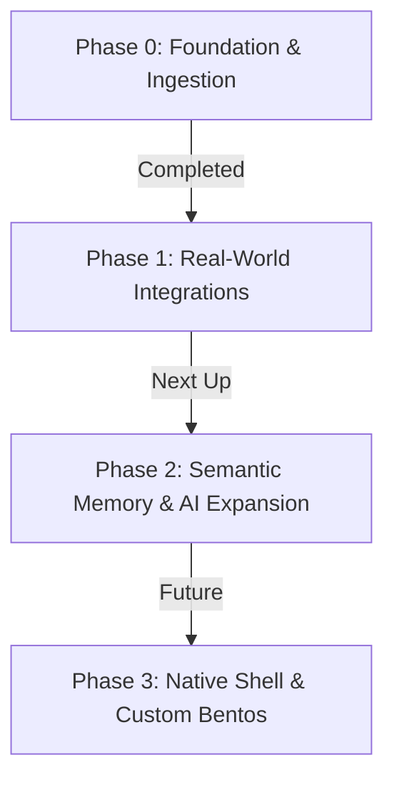

# Rudder — Development Roadmap & Next Up

This document outlines the current implementation status, immediate operational next steps, and future feature milestones for Rudder.

---

## 🗺️ Implementation Phases



---

## 🟩 Phase 0: Foundation & Ingestion (COMPLETED)
*   **Unified Design Tokens:** A cohesive glassmorphic bento-grid UI consuming shared theme variables.
*   **Reality Ledger Database:** SQLite storage with WAL journaling, FTS5-enabled global search, and auto-migrations.
*   **Universal Ingestion Watchers:** Watch folders for Netscape Bookmarks, ChatGPT/Claude logs, Todoist/Google Tasks backups, and Pocket/Instapaper archives.
*   **Robust Sync Errors UI:** Pulse warning badges and explicit directory error logs built into the settings console.
*   **Dry-Run Installer:** Multi-flag bootstrap setup script (`setup.sh --check`).

---

## ⚡ Phase 1: Real-World Integrations (IMMEDIATE NEXT STEPS)
These are the immediate next steps to run and test on your local hardware:

### 1. Hardware Telemetry Testing
*   **Objective:** Stream active heart rate, steps, and sleep values from a wearable or dev board.
*   **Task:** Flash the provided Arduino or MicroPython code template from the settings panel onto a Wi-Fi-enabled microcontroller (ESP32/Raspberry Pi Pico W) and test POSTing payload packets to `http://localhost:3000/api/ingest/telemetry`.

### 2. Ambient Voice Overlay Binding
*   **Objective:** Bind a global macOS hotkey to display the overlay hands-free.
*   **Task:** Set up a macOS Shortcut or global hotkey tool (e.g., Raycast, Alfred, or BetterTouchTool) mapping `Option + Space` to run:
    ```bash
    ./rudder overlay
    ```
    Verify it opens the frameless translucency overlay cleanly above all active windows.

### 3. Active Mail Syncing
*   **Objective:** Ingest real incoming mail threads and test local SMTP replies.
*   **Task:** Enter real IMAP/SMTP credentials in the settings integrations tab, drop an incoming email into your inbox, and verify that the sync daemon auto-drafts responses on the correspondence card.

---

## 🧠 Phase 2: Semantic Memory & AI Expansion (UPCOMING)
*   **Local Vector Embeddings:** Integrate local nomic-embed-text generation via Ollama to store cosine similarity embeddings for all incoming journal/notes entries inside the SQLite vector schema.
*   **Autonomic Swarm Summaries:** Wire a background cron job that utilizes local LLMs (Llama 3.2) to synthesize daily life logs, auto-writing a evening summary entry inside the Biographer module.
*   **HRV-Gated Reflection:** Expose custom reflection prompt widgets that adjust their questioning style based on your active physical recovery indexes.

---

## 🎨 Phase 3: Native Shell & Desktop Primitives (FUTURE)
*   **Native Desktop Build:** Package the Next.js workspace into a lightweight native shell using **Tauri** or **Electron** for a direct application footprint.
*   **Widget Store Expansion:** Enable custom third-party iframe and JSON widget schemas to allow users to build and mount their own bento-box panels dynamically.
*   **Offline Vector Sync:** Multi-machine database replication over secure Tailscale tunnels.
